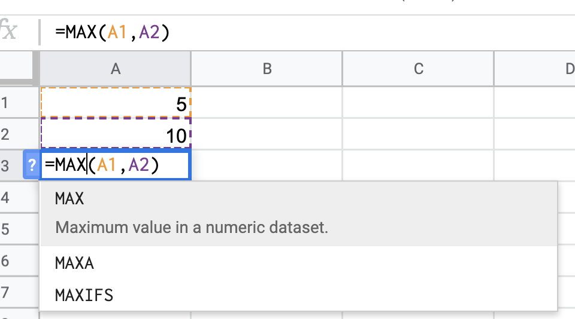
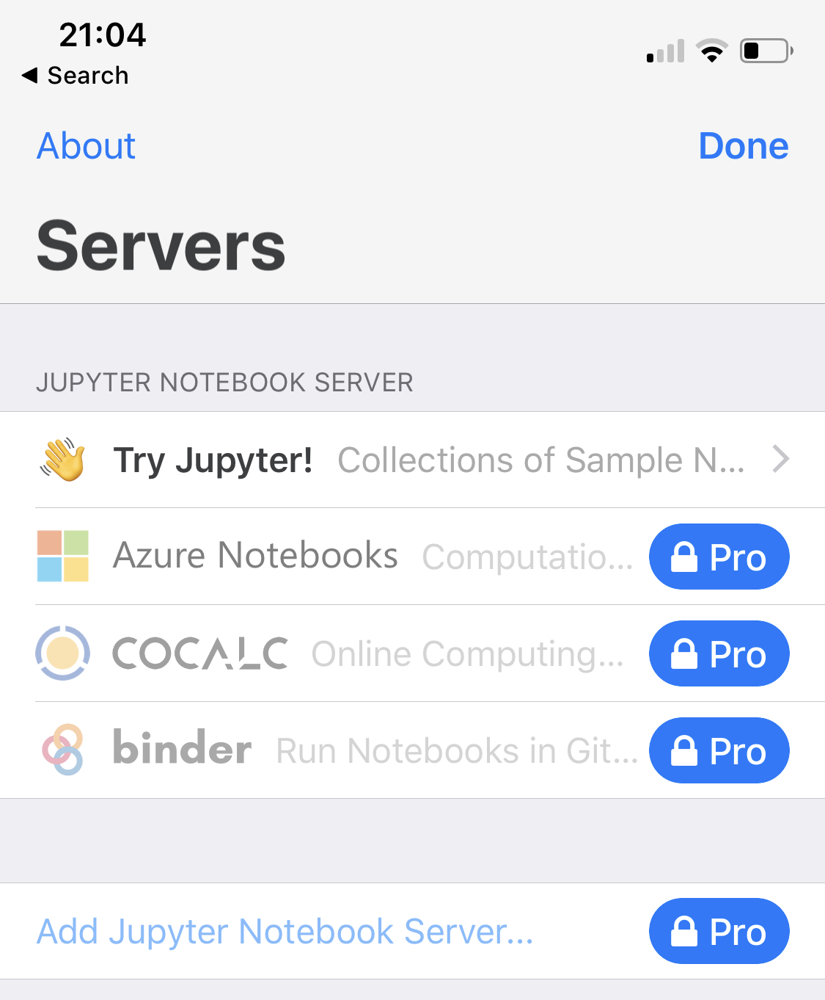

```{r setup, include=FALSE}
options(htmltools.dir.version = FALSE)
```
```{r xaringan-themer, include = FALSE}
library(xaringanthemer)
mono_accent(
  base_color = "#2fa09d",
  background_image = "logo.png",
  background_size = "75px",
  background_position = "3% 97%",
  title_slide_background_image = "lines.png",
  title_slide_background_size = "40%",
  title_slide_background_color = "#FFFFFF",
  title_slide_background_position = "bottom -150px center",
  title_slide_text_color = "#3F4145"
  )
# TODO: customize using the Haven GRC fonts
```

class: bottom, center
background-image: url(rawpixel-633843-unsplash.jpg)
background-size: cover

# PAYOFF

.large[Presentation https://www.kindlyops.com/sira19]

This presentation is made in R Markdown, using the excellent https://github.com/yihui/xaringan package.

You can find the source to this presentation at https://github.com/kindlyops/talks/blob/master/reporter/presentation.Rmd

All photos used with DWYW license from https://unsplash.com

???

Right after lunch so you are going to start feeling sleepy.
Better start by telling you the payoff for sticking around for this talk.
If you do need to step out, or if you want to skip ahead, the slides are online, you can open them from kindlyops.com/sira19
If you grab that URL, open it on your phone or jot it down, the links I reference will easy for you to access later, and you can easily share this presentation with other people at work. The center of the page has a button linking to the presentation, and after the conference when the videos are available I hope to link to the video as well.

So the payoff of this talk is to help you get a raise this year. I am so excited about the results I've been getting with notebooks and the capabilities they unlock that I'm confident you can use them to help your whole org level up, and if that's not worth a raise, maybe you are already paid too much.

Secret goal of this talk is to make you do the thing I want you to do by promising you a raise.

And if I look into the Satir interaction model, the feeling about the feeling: Secret secret goal is to make you think I'm clever by telling you the secret goal, because I Like all humans crave your acceptance and respect.

---
class: inverse, right
background-image: url(spacex-1130894-unsplash.jpg)
background-size: cover

# Your Mission


.pull-right.left[
Try a notebook, modify it, share with one other person

Make your product export notebooks
]

???

So I promised a payoff, what do I actually want you to do when you
leave? Try out a notebook. Specifically, try it out with someone
else, the sharing and remixing aspect. If you try it on your own
it's not so good. I'm going to be giving you an example notebook
to start from with a single click.

Some of you are developing products that analyze and report on data sets. I see you. make your product export notebooks. Don't lock in your customers data, any of the graphs
and reports that you make, make them exportable as notebooks. I dare you.

So the rest of this talk is some stories to try and convince you.

---
class: inverse, bottom, right
background-image: url(mael-balland-1157013-unsplash.jpg)
background-size: cover

# Easy to try<br>Advanced Technology

???

The reason that we are here at this conference, are learning and promoting quantitative risk techniques is because most of us have felt the pinch of needing to have better conversations about risk, to influence better decisions.

The idea at the core of this talk is that when you make it easy for people to try out any new technique, to quickly use it without installing extra software, when it is comfortable and fluid and easy to change one parameter and see the results change, they are likely to start using the techniques on their own. we are looking for lever that will increase the level of cognitive performance across multiple teams, to improve the quality of the conversation that people have before making a decision.

Techniques and tools that used to be very specialized are now cheaply available to anyone who's interested to try them out. The thing that is amazing about drones is the packaging of the technology into a form that requires far less skill from the operator in order to use it to explore and benefit.

---

class: inverse, center
background-image: url(emma-roorda-225458-unsplash.jpg)
background-size: cover

# .large[PLAY]

???

This is something that matters not just for risk analysis, it’s about data science generally. I’d like to see the general workforce develop the ability to use quantitative risk analysis not only for cyber security risk scenarios, but for all kinds of general purpose operational risk scenarios, because it leads to a higher quality conversation and higher quality decision.

Earlier this year Tony, who spoke yesteray, he had an example post on LinkedIn about whether to buy insurance for a phone. Was fabulous because it was an example of a lightweight on-the-fly use of quantitative risk analysis for a spur of the moment scenario.

The only reason that someone can whip up a scenario like that is if it’s easy to use the techniques - when it’s easy enough for people to try these techniques in casual scenarios, in toy scenarios, they will get SO MUCH better and more confident at using them in important scenarios.

Play and experimentation is crucial to getting grassroots adoption of these techniques.

---

class:

# LEVEL UP

* ### spreadsheets (1982)
* ### distributed version control (2002)
* ### notebooks (2015)

???

When I think about the governance part of GRC, I get very interested in how the cognitive ability of groups changes over time, and how they are able to take on harder and harder challenges. I think a lot about tools/levers/cognitive multipliers that work on the front lines, at the edges, that are not exclusively top-down but can be used independently, divergently, experimentally, without centralized permission.

Look back over a few decades, a couple of categories of tools enabled major jumps in productivity and capabilities of the workforce. Version control and spreadsheets. These tools started out as things that specialists used, but over time they spread rapidly into general use.

There came a time when in order to be a professional knowledge worker of any type you needed to know at least the basics of using a spreadsheet. One of the amazing things about spreadsheets is how they usually don’t depend on a server, I can take a model and riff on it, come up with variations, try things out.
 
Similar story happened with version control for code, and in particular distributed version control. I can’t imagine meeting a developer these days who doesn’t know how to use version control, it’s even spreading to designers and general administrative work - we have versioning in dropbox, in google docs, etc.

These dates are editorialized to when I think the tools started to become available in the mainstream, not when the first incarnation was available to early adopters.
Spreadsheets, Visicalc was available in 1979, but Lotus 1-2-3 for PC in 1982 really exploded.
Distributed version control, other systems were available earlier but Bitkeeper and the Linux kernel in 2002 was a defining moment.
Notebooks, Jupyter and Ipython were started earlier, but in 2015 GitHub announced support for rendering Jupyter notebooks.

These tools are not a replacement for the work done using the tools, but they are an accelerator. They make it possible 
for so many more people to do those computations, to build the models, to remix the code, to share the data.

---

class: inverse, right
background-image: url(chris-sabor-524212-unsplash.jpg)
background-size: cover

# working<br>together

???

People who do a lot of work in spreadsheets and people who do a lot of work in code
tend to have strong feelings about their tools. Over the last year, I worked with 
a product development team at a global bank helping them set up a security program that included
risk analysis, and after we introduced notebooks, the feeling changed from "quantitative analysis is too hard" to "this is pretty cool" to
"look I did some additional scenarios what do you think?”
The team not only did some FAIR scenarios, and also some general business reporting on service level objectives.

Lets break down these tools a little to understand them.
---

# Deconstructing a spreadsheet

* A way to refer to a data value by name (address)
* A way to call a function and give it data as parameters



---

# Deconstructing python and R code

* A way to refer to a data value by name (address)
* A way to call a function, and give it data as parameters

.pull-left[
```python
A1 = 5
A2 = 10
max(A1, A2)
```
<br>
```R
A1 <- 5
A2 <- 10
max(A1, A2)
```
]
.pull-right[
### python
<br>
### R
]

???

As you can see, there is a tiny difference in how the data is assigned a name.
In this simple example, the name of the function is the same between Excel, Google Sheets, R, and Python.
The same pattern works whether the function you are calling is calculating `max` or calculating beta-PERT distribution.

---
class: inverse, center
background-image: url(john-jackson-638422-unsplash.jpg)
background-size: cover

# what is inside a notebook?

???

Code and spreadsheets both have a problem, it's awkward to include narrative text. When we are working with analysis of risk scenarios, having narrative text describing the assumptions and details of the scenario is crucial if we hope to reach a shared understanding. Peer review, clarification, refinement, updated information - all requires being able to clearly understand the story being captured in the numbers.

Spreadsheets are super shareable, remixable. Not very traceable. Story about Quality Control staff at drug manufacturing corp that would go in and manually verify algorithms stored in excel spreadsheets to catch accidental changes.

Code is super traceable (via version control), but is not *great* at being remixable and shareable, especially with people in different teams or job types - typically only the authors can read and understand it.

Notebooks are an interesting hybrid that is good at all three things, kind of a better narrative code. The basic concept is a document that has chunks of text, and chunks of code, or formulas, that can be mixed together in an extremely readable way - you can even publish entire books this way, and can be stored in version control, traceable, updateable in a structured way. And they are remixable, you can easily take chunks of a notebook and use them in another notebook. The idea of publication and sharing is baked right in from the start.

Two major flavors of notebooks, one from RStudio called RMarkdown and one from the Jupyter.

---

# Demo notebooks

#### [Jake VanderPlas](http://vanderplas.com) with some example graphs using python.

* Open a copy in Google Colab <a href="https://colab.research.google.com/github/jakevdp/PythonDataScienceHandbook/blob/master/notebooks/04.14-Visualization-With-Seaborn.ipynb"></a>
* Same notebook [rendered by GitHub](https://github.com/jakevdp/PythonDataScienceHandbook/blob/master/notebooks/04.14-Visualization-With-Seaborn.ipynb)
* Same notebook on [Jake's website](https://jakevdp.github.io/PythonDataScienceHandbook/04.14-visualization-with-seaborn.html) with navigation to other chapters of the book 

#### [Will Maier](https://www.linkedin.com/in/whilp/) exploring some quant risk in python

* Open a copy in Google Colab <a href="https://colab.research.google.com/github/kindlyops/fair-examples/blob/master/jupyter/Example_risk_analysis_notebook_scenario_a.ipynb"></a>
* Same notebook [published to my website](https://www.kindlyops.com/knowledge-base/quantitative-risk-python/) inheriting house style

#### [Elliot Murphy](https://linkedin.com/in/emurphy/) playing with basic FAIR calculations in R

* [Rendered in Github](https://github.com/kindlyops/fair-examples/blob/master/rmarkdown/FAIR.md) with no styling
* Published to [RPubs with a default](https://rpubs.com/emurphy77/fair-example) style
* Published to [my website](https://www.kindlyops.com/knowledge-base/fair-example/) inheriting house style


???

The first notebook is a chapter from the Python Data Science book. It is
published on a website, and with a single click you can make your own copy and start editing in Google Colab, which is a hosted environment for Jupyter notebooks in much the same way as Google Docs is a hosted platform for documents. DEMO changing a value and live updating the result.

The exact same notebook is rendered automatically by GitHub.

The exact same notebook is published to Jake's website with some extra navigation forwards and back to other book chapters.

So this first notebook has great examples of doing visualizations, the second notebook has some examples of playing around with distributions and quant risk calculations in python.

The 3rd example is not a Jupyter notebook, it's an RMarkdown notebook. Wrote this using the free RStudio after I took a FAIR training class from RiskLens last year. RStudio has a button to render to github-flavored markdown, which means that the images are generated in a way that github can render a reasonably formatted document. RStudio also has a button to publish to RPubs, which is their publishing platform. I was also able to publish this notebook to my website inheriting the house style.

---

# How far can notebooks go?

* AirBnB Knowledge Repository 2016 https://medium.com/airbnb-engineering/scaling-knowledge-at-airbnb-875d73eff091
 * Reproduciblity
 * Quality - peer review and version control via GitHub
 * Consumability
 * Discoverability
 * Learning - previous work is easily accessible
* Netflix - Scheduling Notebooks 2018 https://medium.com/netflix-techblog/scheduling-notebooks-348e6c14cfd6
 * Notebooks as interactive UI
 * Notebooks as unifying foundation of workflow scheduler
 * 150,000 jobs executing in notebooks per day
  
---

# Scaling down as well


???
iOS client, so you can edit your jupyter notebook from your iPad

---

# Support from major cloud providers

## AWS Sagemaker

## Azure Notebooks

## Google Colab

## Binder and JupyterServer for on-prem
---

# Recap

* #### If you ignite curiosity and develop new capabilities in your organization, it's good for everyone
* #### Notebooks are fantastic. Combine the power of code and spreadsheets in a way that is
 * Shareable
 * Traceable
 * Remixable

* #### If you are building products that do quant risk, please make them export notebooks! Don't hold the data prisoner.

---
background-image: url(lines.png)
background-position: bottom -135px center
background-size: 40%
class: center, middle, final

# "everything can be beautiful"

  elliot@kindlyops.com
